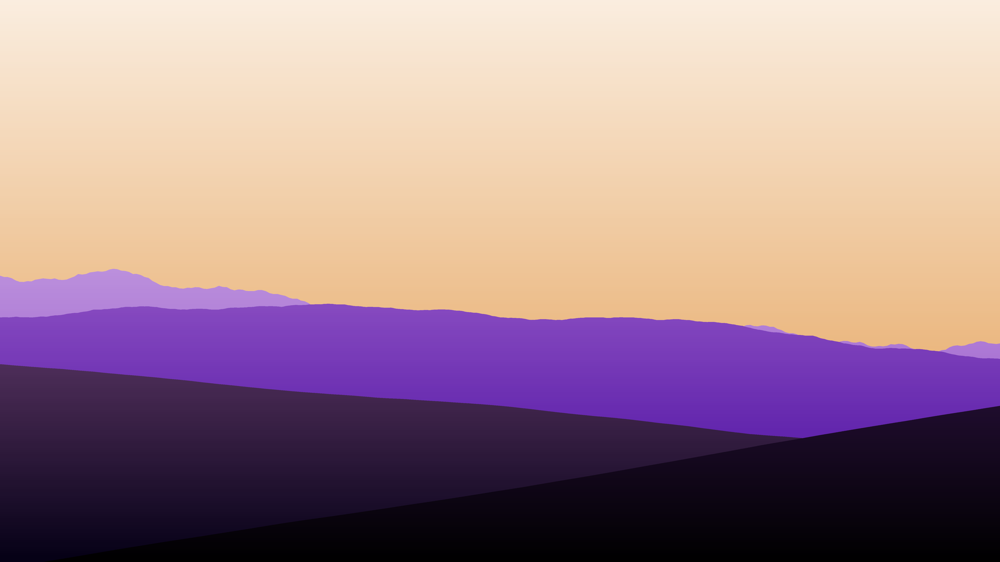
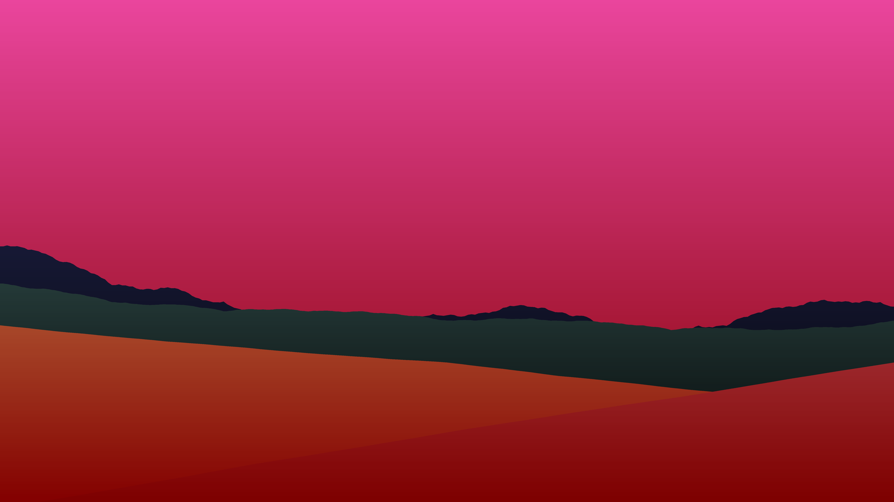
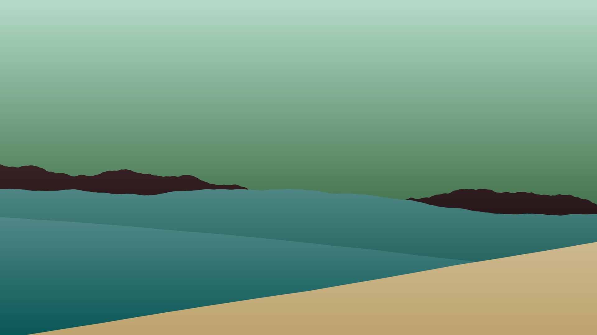
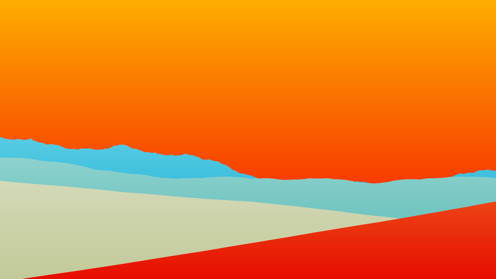

# Land Gen
### Python cli app to generate random landscapes with colourlovers palettes

Modified version of:
https://bitesofcode.wordpress.com/2016/12/23/landscape-generation-using-midpoint-displacement/

I've updated the code to Python 3.10, added a overlay gradient, 
added anti-aliasing via supersampling, removed the sun (although it's just commented out),
save files are now tied to time and date.

<hr>

Open a command prompt and `cd` to a new directory of your choosing:

(optional; recommended) Create a virtual environment with:
```
python -m venv "venv"
venv\Scripts\activate
```

To install do:
```
git clone https://github.com/vluz/LandGen.git
cd LandGen
pip install -r requirements.txt
```

To run do:<br>
`python landgen.py` or `python landgen.py -t theme` (Ex: `python landgen.py -t blue`)

<hr>

Output:       









<hr>

Do not use for production, untested.

<br>
